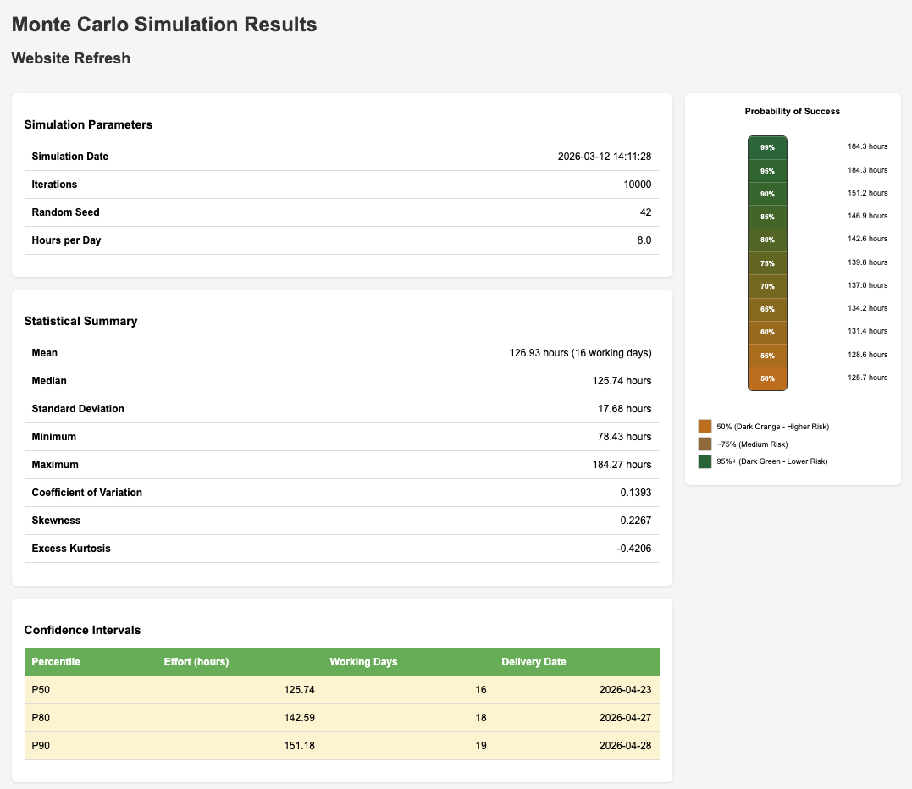

# Quick Start: your first 10 minutes with `mcprojsim`

This guide is for end users who want to get from installation to a first simulation as quickly as possible.

In the next few minutes you will:

1. install `mcprojsim`
2. create a tiny project file
3. validate it
4. run a simulation
5. open the generated report

## Before you start

You need:

- Python 3.14 or newer
- a terminal
- `pipx` for the easiest CLI install

If you do not have `pipx` yet, install it first:

```bash
python3 -m pip install --user pipx
python3 -m pipx ensurepath
```

## 1. Install `mcprojsim`

```bash
pipx install mcprojsim
```

Verify that it works:

```bash
mcprojsim --version
mcprojsim --help
```

## 2. Create your first project file

The quickest way to create a project file is to describe your project in plain text and let `mcprojsim generate` produce the YAML for you.

Create a file named `description.txt`:

```text
Project name: Website Refresh
Description: Small example project
Start date: 2026-04-01

Task 1:
- Design updates
- Size: S

Task 2:
- Frontend changes
- Depends on Task 1
- Size: M
```

Generate the project file:

```bash
mcprojsim generate description.txt -o quickstart_project.yaml
```

That is it — the generated `project.yaml` is ready for validation and simulation. You can use T-shirt sizes (`XS`, `S`, `M`, `L`, `XL`, `XXL`), story points, or explicit `low/expected/high` estimates. See the [MCP Server & Natural Language Input](docs/user_guide/mcp-server.md) guide for the full input format.

??? tip "Alternative: write the YAML by hand"

    If you prefer full control, create `quickstart_project.yaml` manually where you can specify all available fields. The minimum required fields are `project.name`, `project.start_date`, and at least one task with an estimate. In the previous we used T-shirt sizes for the estimates, but here is the same project with explicit `low/expected/high` estimates in days:

    ```yaml
    project:
      name: "Website Refresh"
      description: "Small example project"
      start_date: "2026-04-01"
      confidence_levels: [50, 80, 90]

    tasks:
      - id: "task_001"
        name: "Design updates"
        estimate:
          low: 2
          expected: 3
          high: 5
          unit: "days"

      - id: "task_002"
        name: "Frontend changes"
        estimate:
          low: 4
          expected: 6
          high: 10
          unit: "days"
        dependencies: ["task_001"]
    ```

See the [project file reference](docs/user_guide/project_files.md) for all available fields.

This example is intentionally small — two tasks, one dependency, but that is enough for a meaningful first simulation!

`
## 3. Validate the file

Before simulating, validate the input:

```bash
mcprojsim validate quickstart_project.yaml
```

Expected result:

```text
✓ Project file is valid!
```

If validation fails, read the reported field name and fix the YAML file before continuing.

## 4. Run your first simulation

```bash
mcprojsim simulate quickstart_project.yaml --seed 42 --table
```

What this does:

- runs the default number of simulation iterations
- uses `--seed 42` so the result is reproducible
- writes result files into your current working directory

You should see a summary with values such as:

- mean duration (in hours and working days)
- median (`P50`)
- higher-confidence targets such as `P80` and `P90`
- projected delivery dates (weekends excluded)

The output will now be the following:

```bash
% mcprojsim simulate quickstart_example.yaml --seed 42 --table
mcprojsim, version 0.4.7
Progress: 100.0% (10000/10000)

=== Simulation Results ===
┌──────────────────────────┬────────────────────────────────┐
│ Parameter                │ Value                          │
├──────────────────────────┼────────────────────────────────┤
│ Project                  │ Website Refresh                │
│ Hours per Day            │ 8.0                            │
│ Mean                     │ 126.93 hours (16 working days) │
│ Median (P50)             │ 125.74 hours                   │
│ Std Dev                  │ 17.68 hours                    │
│ Coefficient of Variation │ 0.1393                         │
│ Skewness                 │ 0.2267                         │
│ Excess Kurtosis          │ -0.4206                        │
└──────────────────────────┴────────────────────────────────┘

Confidence Intervals:
┌──────────────┬─────────┬────────────────┬────────────┐
│ Percentile   │   Hours │   Working Days │ Date       │
├──────────────┼─────────┼────────────────┼────────────┤
│ P50          │  125.74 │             16 │ 2026-04-23 │
│ P80          │  142.59 │             18 │ 2026-04-27 │
│ P90          │  151.18 │             19 │ 2026-04-28 │
└──────────────┴─────────┴────────────────┴────────────┘

Sensitivity Analysis (top contributors):
┌──────────┬───────────────┐
│ Task     │ Correlation   │
├──────────┼───────────────┤
│ task_002 │ +0.8911       │
│ task_001 │ +0.4236       │
└──────────┴───────────────┘

Schedule Slack:
┌──────────┬─────────────────┬──────────┐
│ Task     │   Slack (hours) │ Status   │
├──────────┼─────────────────┼──────────┤
│ task_001 │               0 │ Critical │
│ task_002 │               0 │ Critical │
└──────────┴─────────────────┴──────────┘

Most Frequent Critical Paths:
  1. task_001 -> task_002 (10000/10000, 100.0%)

No export formats specified. Use -f to export results to files.
```


## 5. Generate HTML report and open it

By default, no export formats are specified, so the results are only printed to the terminal. 
To get the full report with all details, use the `-f` flag.

The supported formats are `json`, `csv`, and `html`. The HTML report is the most user-friendly for a first look, as it includes all the details and visualizations.

```bash
mcprojsim simulate quickstart_project.yaml --seed 42 -f html
```

Opening the generated HTML report (`Website Refresh_results.html`) will give you a detailed view of the results, including:

- project summary
- confidence intervals
- the full distribution of outcomes
- sensitivity analysis showing which tasks contribute most to uncertainty
- schedule slack information
- critical path analysis
- risk impact analysis
- statistical distribution metrics such as skewness and kurtosis
- and more!

On macOS you can open the HTML report using the following command:

```bash
open "Website Refresh_results.html"
```

The first part of the generated HTML is shown below to give you a preview of what to expect:




## 6. Useful next commands

Run again with more iterations:

```bash
mcprojsim simulate project.yaml --iterations 50000 --seed 42 --table
```

Use a custom configuration file:

```bash
mcprojsim simulate project.yaml --config my_config.yaml --seed 42 --table
```

Suppress progress output:

```bash
mcprojsim simulate project.yaml --quiet
```

## What the main results mean

- `P50`: about a 50% chance of finishing within this many hours of effort
- `P80`: a more conservative planning target
- `P90`: a high-confidence planning target

The simulator reports all results in **hours** (the canonical internal unit). It also shows **working days** (hours ÷ hours_per_day, rounded up) and **projected delivery dates** (skipping weekends from the project's `start_date`).

A common practical pattern is:

- use `P50` for internal discussion
- use `P80` or `P90` for commitments where lateness matters

## If you want to go further

After this first run, the best next documents are:

- [docs/getting_started.md](docs/getting_started.md) — a fuller walkthrough
- [docs/user_guide/introduction.md](docs/user_guide/introduction.md) — Monte Carlo concepts
- [docs/user_guide/your_first_project.md](docs/user_guide/your_first_project.md) — build richer project files step by step
- [docs/user_guide/project_files.md](docs/user_guide/project_files.md) — project file reference
- [docs/configuration.md](docs/configuration.md) — uncertainty factors and config
- [docs/examples.md](docs/examples.md) — example projects

## Need a different installation path?

This guide intentionally focuses on the fastest end-user path.

If `pipx` is not the right fit, see:

- [README.md](README.md) for the project overview
- [docs/user_guide/getting_started.md](docs/user_guide/getting_started.md) for basic install and first-run material
- [scripts/README.md](scripts/README.md) if you are working from a source checkout here is a description for how ti use the helper scripts to set up a local development environment and run tests.

If you are a developer, see the [Development Guide](docs/development_guide.md) for instructions on setting up a local development environment, running tests, and contributing to the project.
