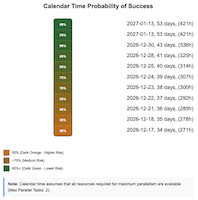
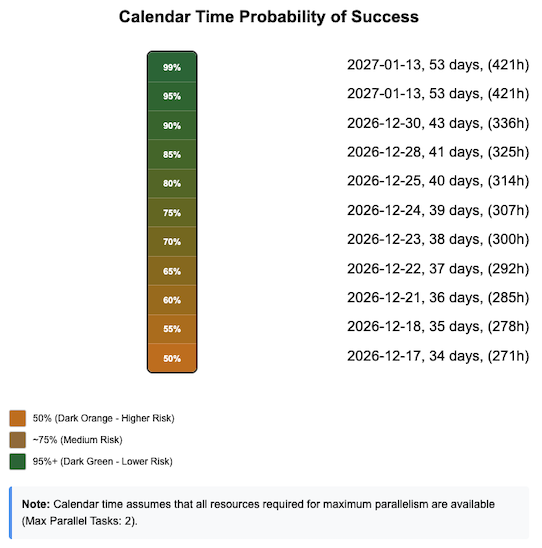
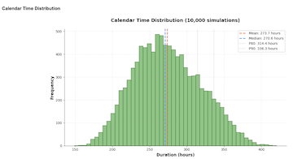
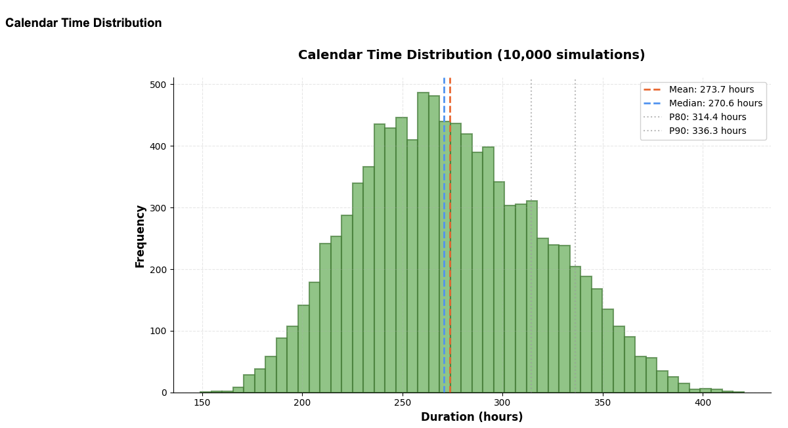
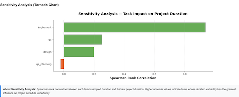
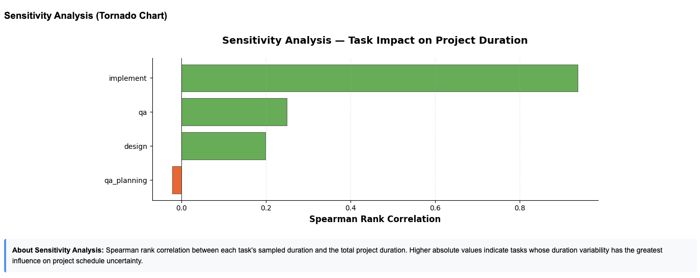

# Monte Carlo Project Simulator (mcprojsim)


**Stop guessing deadlines. Start simulating them.**

| Category | Link |
|----------|--------|
|**Package**|[](https://pypi.org/project/mcprojsim/) [](https://www.python.org/downloads/)|
|**Documentation**|[](https://johan162.github.io/mcprojsim/)|
|**License**|[](https://opensource.org/licenses/MIT)|
|**Release**|[](https://github.com/johan162/mcprojsim/releases)|
|**CI/CD**|[](https://github.com/johan162/mcprojsim/actions/workflows/ci.yml) [](https://github.com/johan162/mcprojsim/actions/workflows/docs.yml) [](coverage.svg)|
|**Code Quality**|[](https://github.com/psf/black) [](https://mypy-lang.org/) [](https://flake8.pycqa.org/)|
|Repo URL|[](https://github.com/johan162/mcprojsim)|

## Overview

`mcprojsim` is a Monte Carlo simulation tool for agile software project estimation. Rather than producing a single deadline, it models uncertainty across task durations, dependencies, risks, and resource constraints to generate confidence-weighted schedule forecasts.

Use it when you need answers like:

- What is the realistic completion range — P10 through P99 — for this project?
- When is there a 50%, 80%, or 90% probability of delivery?
- Which tasks most frequently land on the critical path?
- How do specific risks or uncertainty factors shift the final forecast?

## Key features

- Monte Carlo schedule simulation with configurable iterations, P10–P99 confidence percentiles, and reproducible seeds
- **Parallel simulation** with `--workers N` to distribute iterations across multiple CPU cores for faster results on large projects
- Flexible task estimates: explicit low/expected/high ranges, T-shirt sizes, story points, and multi-category symbolic sizing
- Two-pass criticality-aware resource scheduling for optimised assignment under resource contention
- Dependency-only scheduling alongside resource- and calendar-constrained scheduling
- Risk and uncertainty factor modelling at task and project level
- Cost estimation and budget analysis: per-task hourly rates, fixed costs, risk cost impacts, overhead multipliers, budget confidence intervals, and joint schedule-and-budget probability queries
- Rich analysis: percentile forecasts, critical-path sequences, sensitivity (Tornado) charts, slack, risk impact, staffing recommendations, and delivery-date probability
- JSON, CSV, and HTML export with configurable distribution chart histogram bins; optional ASCII table output in the CLI
- Natural-language project generation from plain text via `mcprojsim generate`
- MCP server for AI-assistant-driven generation, validation, and simulation workflows
- Sprint planning with empirical or negative-binomial velocity models, sickness modelling, spillover, and historical sprint data import

## Recommended installation

Most users fall into one of two paths:

- **Terminal-first CLI usage**: install with `pipx`.
- **MCP-assisted usage**: use the released MCP bundle or the optional MCP package install described in [MCP Server Setup](https://johan162.github.io/mcprojsim/user_guide/mcp-server/).

For direct terminal-only CLI usage, `pipx` remains the simplest manual install path:

```bash
python3 -m pip install --user pipx
python3 -m pipx ensurepath
pipx install mcprojsim
```

Then verify the installation:

```bash
mcprojsim --help
mcprojsim --version
```

For the fastest first run, start with [Quickstart Guide](https://johan162.github.io/mcprojsim/quickstart/). For the fuller documentation path after that, use the published [User Guide](https://johan162.github.io/mcprojsim/).

> [!TIP]
> Project files can be written in YAML or TOML. The CLI auto-detects the format from the file extension.

> [!TIP]
> A Docker image is available for isolated environments. The accompanying script `bin/mcprojsim.sh` wraps the container with the same interface as the `pipx`-installed CLI.


## Minimal example

Create a file named `project.yaml`:

```yaml
project:
  name: "Auth Service Rewrite"
  start_date: "2026-11-01"
  confidence_levels: [50, 80, 90]

tasks:
  - id: "design"
    name: "API design & tech spike"
    estimate: { low: 2, expected: 4, high: 8, unit: "days" }

  - id: "qa_planning"
    name: "QA planning for how to verify the new service"
    estimate: { low: 3, expected: 4, high: 6, unit: "days" }

  - id: "implement"
    name: "Core implementation"
    estimate: { low: 8, expected: 14, high: 25, unit: "days" }
    dependencies: ["design"]
    uncertainty_factors:
      technical_complexity: "high"

  - id: "qa"
    name: "Integration testing"
    estimate: { low: 3, expected: 5, high: 10, unit: "days" }
    dependencies: ["implement","qa_planning"]
```

Validate the file:

```bash
mcprojsim validate project.yaml
```

Run a simulation:

```bash
mcprojsim simulate project.yaml --seed 12345 --table --minimal
```

This will generate output to the console as shown below:

```
=== Simulation Results ===

Project Overview:
┌────────────────────────────────┬──────────────────────┐
│ Field                          │ Value                │
├────────────────────────────────┼──────────────────────┤
│ Project                        │ Auth Service Rewrite │
│ Start Date                     │ 2026-11-01           │
│ Number of Tasks                │ 4                    │
│ Effective Default Distribution │ triangular           │
│ T-Shirt Category Used          │ story                │
│ Hours per Day                  │ 8.0                  │
│ Max Parallel Tasks             │ 2                    │
│ Schedule Mode                  │ dependency_only      │
└────────────────────────────────┴──────────────────────┘

Calendar Time Statistical Summary:
┌──────────────┬────────────────────────────────┐
│ Metric       │ Value                          │
├──────────────┼────────────────────────────────┤
│ Mean         │ 273.74 hours (35 working days) │
│ Median (P50) │ 270.60 hours                   │
│ Std Dev      │ 44.92 hours                    │
│ Minimum      │ 149.01 hours                   │
│ Maximum      │ 420.56 hours                   │
└──────────────┴────────────────────────────────┘

Project Effort Statistical Summary:
┌──────────────┬──────────────────────────────────────┐
│ Metric       │ Value                                │
├──────────────┼──────────────────────────────────────┤
│ Mean         │ 308.45 person-hours (39 person-days) │
│ Median (P50) │ 305.37 person-hours                  │
│ Std Dev      │ 45.09 person-hours                   │
│ Minimum      │ 182.62 person-hours                  │
│ Maximum      │ 458.34 person-hours                  │
└──────────────┴──────────────────────────────────────┘

Calendar Time Confidence Intervals:
┌──────────────┬─────────┬────────────────┬────────────┐
│ Percentile   │   Hours │   Working Days │ Date       │
├──────────────┼─────────┼────────────────┼────────────┤
│ P50          │  270.6  │             34 │ 2026-12-17 │
│ P80          │  314.37 │             40 │ 2026-12-25 │
│ P90          │  336.27 │             43 │ 2026-12-30 │
└──────────────┴─────────┴────────────────┴────────────┘
```

Output can also be generated in other formats. Typical outputs (see the `--help` for how to specify output) include:

- `*_results.json` for full machine-readable output
- `*_results.csv` for tabular summaries
- `*_results.html` for a browsable report with graphs and tables


| Example figures from the HTML report |
|-------------------|
| <br>***Fig 1: Confidence intervals***<br><details><summary>*Click to view full size...*</summary></details><br>  | 
| <br>***Fig 2: Schedule Histogram***<br><details><summary>*Click to view full size...*</summary></details><br> | 
| <br>***Fig 3: Tornado Chart (Spearman Rank Correlation)***<br><details><summary>*Click to view full size...*</summary> </details><br>  |

## Documentation map

Use the entry point that matches your goal:

|Documentation Link|Purpose|
|------------------|-------|
| [Quickstart Guide](https://johan162.github.io/mcprojsim/quickstart/) | Fastest terminal-based first run |
| [User Documentation](https://johan162.github.io/mcprojsim/) | The full documentation site |
| [User Guide](https://johan162.github.io/mcprojsim/user_guide/01_getting_started/) | The User Guide section |
| [Development Guide](https://johan162.github.io/mcprojsim/development/) | contributor and source-checkout workflows |


Additional runnable examples can be seen in the [Examples section](https://johan162.github.io/mcprojsim/examples/) of the user guide or in the project directory [examples/](examples/).

## Example commands

```bash
# Generate a project file from a natural language description
mcprojsim generate examples/nl_example.txt -o my_project.yaml

# Validate an input file
mcprojsim validate examples/sample_project.yaml

# Run a reproducible simulation
mcprojsim simulate examples/sample_project.yaml --seed 42

# Use a custom configuration
mcprojsim simulate examples/sample_project.yaml --config examples/sample_config.yaml --seed 42

# Calculate probability of meeting a target date
mcprojsim simulate examples/sample_project.yaml --target-date 2026-06-01

# Format tabular sections for easier reading
mcprojsim simulate examples/sample_project.yaml --table --seed 42

# Show current configuration defaults
mcprojsim config

# Generate a default config file at ~/.mcprojsim/config.yaml
mcprojsim config --generate
```

For full CLI coverage, including constrained scheduling, sprint planning, quiet/minimal modes, staffing, and export options, see [Running Simulations](https://johan162.github.io/mcprojsim/user_guide/running_simulations/).


## MCP server integration

`mcprojsim` can run as a [Model Context Protocol](https://modelcontextprotocol.io/) (MCP) server, letting AI assistants such as GitHub Copilot, Claude Desktop, or any MCP-compatible client generate project files, validate descriptions, and run simulations conversationally.

Install the released MCP bundle from GitHub Releases, or follow the manual setup in [MCP Server Setup](https://johan162.github.io/mcprojsim/user_guide/mcp-server/) for installation tradeoffs and natural-language input examples.

### Example prompt to install `mcprojsim` as an MCP server:

```txt
Download and install the latest mcprojsim MCP server from GitHub Releases. Follow the README.md for installation instructions.
```

See the MCP server [detailed documentation](https://johan162.github.io/mcprojsim/user_guide/mcp-server/#what-is-the-mcp-server) for examples of using the server.


## Citation

If you use this tool in research or project planning, please cite:

```text
@software{mcprojsim,
  title = {Monte Carlo Project Simulator},
  author = {Johan Persson},
  year = {2026},
  url = {https://github.com/johan162/mcprojsim},
  version = {0.15.1}
}
```

## License

MIT License - see [LICENSE](LICENSE).

## Acknowledgments

Inspired by the work of:

- Steve McConnell - *Software Estimation: Demystifying the Black Art*
- Frederick Brooks - *The Mythical Man-Month*
- Douglas Hubbard - *How to Measure Anything in Cybersecurity Risk*
- Kahneman, Sibony, Sunstein - *Noise: A Flaw in Human Judgment*
- William Poundstone - *Doomsday Calculation*
- Daniel S. Vacanti - *When Will it Be Done?*
- Lawrence Weinstein - *guesstimation 2.0*
